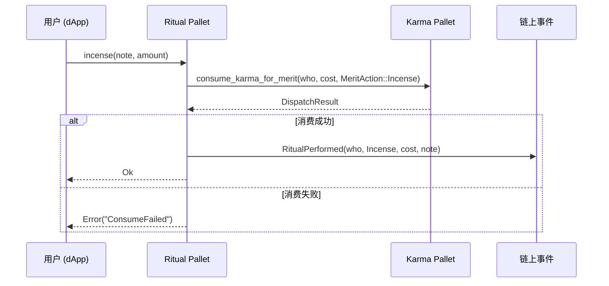

# Ritual Pallet (祭祀功德 Pallet)

## 概述

`Ritual Pallet` 是 BuddhaLand 生态系统中专注于传统佛教祭祀行为的功德消费模块。它提供四种经典祭祀动作以及自定义功德行为的链上记录与 Karma 消费机制。

**核心定位**：
- **职责专一**：仅处理祭祀行为的 Karma 消费，不涉及存储或复杂状态管理
- **数据最小化**：采用事件驱动设计，通过 `RitualPerformed` 事件记录所有祭祀行为
- **依赖分离**：完全依赖 `Karma Pallet` 进行功德值管理，保持架构清晰

## 术语对齐：祭祀行为（Ritual Actions）

基于《佛境文档.md》中的功德体系设计，本 Pallet 对齐以下佛教传统术语：

| 中文术语 | 英文标识 | MeritAction 枚举 | 功能说明 |
|---------|---------|------------------|----------|
| 上香 | Incense | `MeritAction::Incense` | 燃香供佛，表达虔诚心意 |
| 点灯 | Light Lamp | `MeritAction::LightLamp` | 点燃明灯，祈求智慧光明 |
| 供花 | Offer Flower | `MeritAction::Flower` | 鲜花供养，庄严道场 |
| 布施/捐赠 | Donation | `MeritAction::Donation` | 财物布施，积累功德 |
| 自定义祭祀 | Custom Ritual | `MeritAction::Other(code)` | 扩展性祭祀行为 |

**注意**：所有祭祀行为均通过 `pallet_karma::KarmaProvider::consume_karma_for_merit` 接口消费功德值。

## 依赖与集成

### 外部依赖
- **Karma Pallet**: 提供 `KarmaProvider` trait 和 `MeritAction` 枚举
- **Frame Support**: 基础区块链功能支持

### 数据流向


## 类型定义与配置

### Config Trait
```rust
pub trait Config: frame_system::Config {
    type RuntimeEvent: From<Event<Self>> + IsType<<Self as frame_system::Config>::RuntimeEvent>;
    /// 各类祭祀动作的默认 Karma 消耗
    #[pallet::constant]
    type DefaultIncenseCost: Get<KarmaBalance>;
    #[pallet::constant]
    type DefaultLampCost: Get<KarmaBalance>;
    #[pallet::constant]
    type DefaultFlowerCost: Get<KarmaBalance>;
    #[pallet::constant]
    type DefaultDonationCost: Get<KarmaBalance>;
}
```

**配置说明**：
- 四种祭祀行为各有独立的默认成本配置
- 用户可选择性覆盖默认成本（通过 `amount` 参数）

## 存储设计

**无链上存储**：`Ritual Pallet` 采用完全无状态设计，所有数据通过以下方式处理：
- **祭祀记录**：通过 `RitualPerformed` 事件记录
- **功德消费**：委托给 `Karma Pallet` 的 `MeritConsumptionHistory` 存储
- **历史查询**：通过事件索引或 Karma Pallet 的查询接口

## 事件类型

### RitualPerformed
```rust
/// 祭祀事件：账户、动作、消耗数量、备注
RitualPerformed(T::AccountId, MeritAction, KarmaBalance, Vec<u8>),
```

**参数说明**：
- `T::AccountId`: 执行祭祀的用户账户
- `MeritAction`: 具体的祭祀行为类型
- `KarmaBalance`: 实际消费的功德值数量
- `Vec<u8>`: 用户提供的祭祀备注（如祈愿内容）

## 错误类型

```rust
pub enum Error<T> {
    /// 备注内容过长或无效
    InvalidNote,
    /// 无效的自定义动作编号
    InvalidCustomAction,
}
```

**错误处理**：
- Karma 相关错误（余额不足、消费失败等）由 `Karma Pallet` 处理
- `Ritual Pallet` 仅处理自身逻辑错误

## 可调用函数 (Extrinsics)

### 1. incense - 上香
```rust
pub fn incense(
    origin: OriginFor<T>, 
    note: Vec<u8>, 
    amount: Option<KarmaBalance>
) -> DispatchResultWithPostInfo
```
- **功能**：燃香供佛，消费 Karma 表达虔诚
- **默认成本**：`DefaultIncenseCost`
- **自定义成本**：通过 `amount` 参数覆盖默认值

### 2. light_lamp - 点灯
```rust
pub fn light_lamp(
    origin: OriginFor<T>, 
    note: Vec<u8>, 
    amount: Option<KarmaBalance>
) -> DispatchResultWithPostInfo
```
- **功能**：点燃明灯，祈求智慧与光明
- **默认成本**：`DefaultLampCost`

### 3. offer_flower - 供花
```rust
pub fn offer_flower(
    origin: OriginFor<T>, 
    note: Vec<u8>, 
    amount: Option<KarmaBalance>
) -> DispatchResultWithPostInfo
```
- **功能**：鲜花供养，庄严道场
- **默认成本**：`DefaultFlowerCost`

### 4. donate - 布施/捐赠
```rust
pub fn donate(
    origin: OriginFor<T>, 
    note: Vec<u8>, 
    amount: Option<KarmaBalance>
) -> DispatchResultWithPostInfo
```
- **功能**：财物布施，积累功德
- **默认成本**：`DefaultDonationCost`

### 5. custom - 自定义祭祀
```rust
pub fn custom(
    origin: OriginFor<T>, 
    code: u8, 
    note: Vec<u8>, 
    amount: KarmaBalance
) -> DispatchResultWithPostInfo
```
- **功能**：自定义祭祀行为，扩展性支持
- **成本**：必须显式指定 `amount`
- **限制**：`code > 0`

## 权重 (Weights)

所有 extrinsics 当前使用固定权重 `10_000`：

```rust
#[pallet::weight(10_000)]
```

**注意**：生产环境建议通过 `frame-benchmarking` 进行基准测试以获得准确权重。

## 运行时集成示例

```rust
impl pallet_ritual::Config for Runtime {
    type RuntimeEvent = RuntimeEvent;
    type DefaultIncenseCost = ConstU128<100>;      // 上香默认消费 100 Karma
    type DefaultLampCost = ConstU128<150>;         // 点灯默认消费 150 Karma
    type DefaultFlowerCost = ConstU128<80>;        // 供花默认消费 80 Karma
    type DefaultDonationCost = ConstU128<200>;     // 布施默认消费 200 Karma
}

construct_runtime!(
    pub enum Runtime where
        Block = Block,
        NodeBlock = Block,
        UncheckedExtrinsic = UncheckedExtrinsic,
    {
        System: frame_system,
        Karma: pallet_karma,
        Ritual: pallet_ritual,  // 添加 Ritual Pallet
    }
);
```

## 前端调用示例 (TypeScript)

```typescript
import { ApiPromise } from '@polkadot/api';

// 上香祭祀
async function performIncense(api: ApiPromise, keyring: any, note: string, customAmount?: number) {
  const noteBytes = new TextEncoder().encode(note);
  const amount = customAmount ? api.createType('Option<u128>', customAmount) : api.createType('Option<u128>', null);
  
  const tx = api.tx.ritual.incense(noteBytes, amount);
  const hash = await tx.signAndSend(keyring);
  console.log('上香交易哈希:', hash.toHex());
}

// 监听祭祀事件
async function listenRitualEvents(api: ApiPromise) {
  api.query.system.events((events: any) => {
    events.forEach((record: any) => {
      const { event } = record;
      if (event.section === 'ritual' && event.method === 'RitualPerformed') {
        const [account, action, amount, note] = event.data;
        console.log(`祭祀记录: ${account} 执行 ${action} 消费 ${amount} Karma`);
        console.log(`备注: ${new TextDecoder().decode(note)}`);
      }
    });
  });
}

// 批量祭祀示例
async function performMultipleRituals(api: ApiPromise, keyring: any) {
  const txs = [
    api.tx.ritual.incense(new TextEncoder().encode('祈求平安'), null),
    api.tx.ritual.lightLamp(new TextEncoder().encode('点亮智慧'), null),
    api.tx.ritual.offerFlower(new TextEncoder().encode('庄严道场'), null),
  ];
  
  const batchTx = api.tx.utility.batch(txs);
  await batchTx.signAndSend(keyring);
}
```

## 安全与隐私

### 功德消费安全
- **余额检查**：通过 `Karma Pallet` 自动验证 Karma 余额
- **防重入**：无状态设计避免重入攻击
- **错误处理**：Karma 消费失败时自动回滚

### 数据隐私
- **备注内容**：存储在事件中，链上公开可见
- **敏感信息**：避免在 `note` 参数中包含敏感个人信息
- **数据最小化**：仅记录必要的祭祀行为数据

## 序列图（简化）



## 基准测试与权重模板 (frame-benchmarking)

### 1. 添加 WeightInfo Trait

在 `src/lib.rs` 中添加权重接口：

```rust
pub trait WeightInfo {
    fn incense() -> Weight;
    fn light_lamp() -> Weight;
    fn offer_flower() -> Weight;
    fn donate() -> Weight;
    fn custom() -> Weight;
}

// 开发环境默认实现
impl WeightInfo for () {
    fn incense() -> Weight { Weight::from_parts(10_000, 0) }
    fn light_lamp() -> Weight { Weight::from_parts(10_000, 0) }
    fn offer_flower() -> Weight { Weight::from_parts(10_000, 0) }
    fn donate() -> Weight { Weight::from_parts(10_000, 0) }
    fn custom() -> Weight { Weight::from_parts(10_000, 0) }
}
```

### 2. 基准测试文件模板

创建 `src/benchmarking.rs`：

```rust
#![cfg(feature = "runtime-benchmarks")]

use super::*;
use frame_benchmarking::{benchmarks, impl_benchmark_test_suite, whitelisted_caller};
use frame_system::RawOrigin;
use sp_std::vec;

benchmarks! {
    incense_small_note {
        let caller: T::AccountId = whitelisted_caller();
        // 预设 Karma 余额
        <pallet_karma::Pallet<T> as KarmaProvider<T::AccountId>>::reward_karma(
            &caller, 1000u128.into(), pallet_karma::RewardReason::ManualAdjust
        ).unwrap();
        let note = vec![0u8; 32]; // 小备注
    }: incense(RawOrigin::Signed(caller), note, None)

    incense_large_note_with_amount {
        let caller: T::AccountId = whitelisted_caller();
        <pallet_karma::Pallet<T> as KarmaProvider<T::AccountId>>::reward_karma(
            &caller, 1000u128.into(), pallet_karma::RewardReason::ManualAdjust
        ).unwrap();
        let note = vec![0u8; 256]; // 大备注
        let amount = Some(200u128.into());
    }: incense(RawOrigin::Signed(caller), note, amount)

    custom_ritual {
        let caller: T::AccountId = whitelisted_caller();
        <pallet_karma::Pallet<T> as KarmaProvider<T::AccountId>>::reward_karma(
            &caller, 1000u128.into(), pallet_karma::RewardReason::ManualAdjust
        ).unwrap();
        let note = vec![0u8; 128];
    }: custom(RawOrigin::Signed(caller), 42u8, note, 150u128.into())
}

impl_benchmark_test_suite!(Pallet, crate::mock::new_test_ext(), crate::mock::Test);
```

### 3. 生成权重文件 (Windows)

```bash
# 在项目根目录执行
cargo build --release --features runtime-benchmarks
.\target\release\buddhaland-node benchmark pallet ^
    --chain dev ^
    --pallet pallet_ritual ^
    --extrinsic "*" ^
    --steps 50 ^
    --repeat 20 ^
    --output ./pallets/ritual/src/weights.rs
```

### 4. Runtime 集成权重

```rust
impl pallet_ritual::Config for Runtime {
    type RuntimeEvent = RuntimeEvent;
    type WeightInfo = pallet_ritual::weights::SubstrateWeight<Runtime>; // 使用生成的权重
    type DefaultIncenseCost = ConstU128<100>;
    // ... 其他配置
}
```

## 测试建议

### 单元测试
- 测试各祭祀函数的 Karma 消费逻辑
- 验证事件正确触发
- 测试错误处理（Karma 不足、无效参数等）

### 集成测试
- 与 `Karma Pallet` 的集成测试
- 批量祭祀交易测试
- 前端事件监听测试

## 兼容性与扩展性

### 向后兼容
- 新增 `MeritAction` 变体时保持现有枚举值不变
- 配置参数采用常量形式，便于 runtime 升级

### 扩展方向
- **季节性祭祀**：根据佛教节日添加特殊祭祀行为
- **集体祭祀**：支持多用户协作的大型法会活动
- **NFT 集成**：将祭祀行为与数字文物、功德证书关联
- **元宇宙应用**：与 WebGL 3D 场景联动的沉浸式祭祀体验

---

**开发者注意**：本 Pallet 设计遵循 Substrate 最佳实践，采用职责单一、依赖分离的架构。所有 Karma 相关逻辑委托给专门的 `Karma Pallet`，确保代码简洁、易维护。