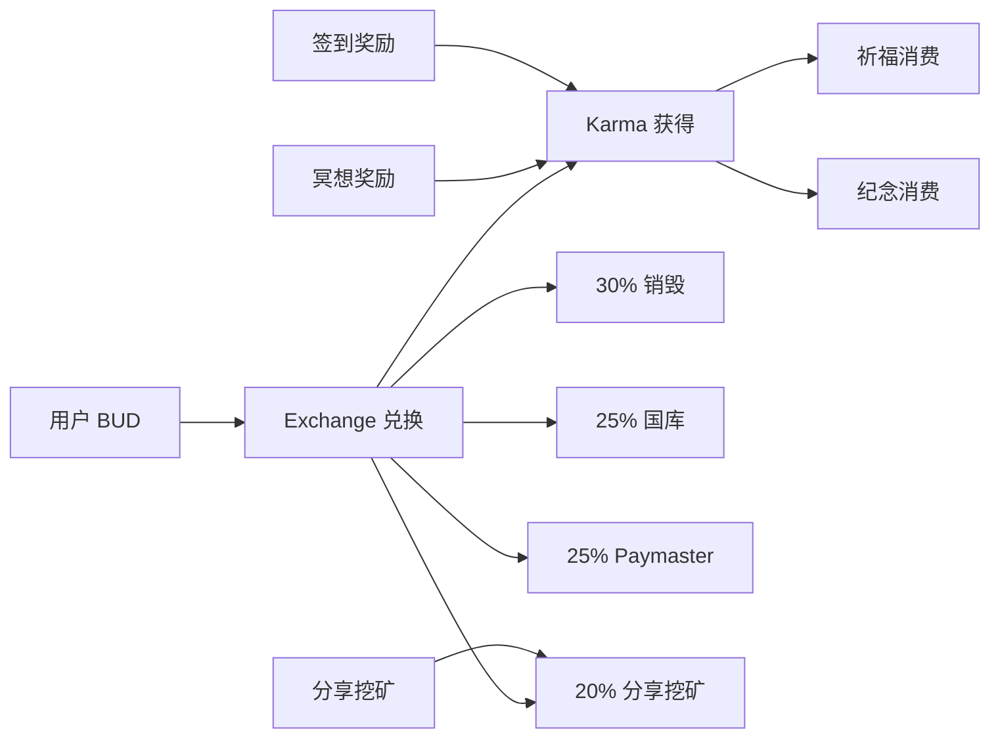

# BuddhaLand 佛境：Web3 禅修生态系统技术文档

## 概述

BuddhaLand（佛境）是基于 Substrate/Polkadot 生态构建的去中心化禅修平台，结合现代脑波科技与区块链技术，为全球修行者提供可验证、可激励的禅修体验。平台采用 React + TypeScript 技术栈，实现浏览器端的轻量级 2D 数据可视化与交互体验。

### 核心特性
- **Web3 原生**：与 Substrate Runtime Pallets 无缝交互
- **脑波驱动**：真实脑波数据验证禅修状态，防止作弊
- **2D 数据可视化**：基于 Canvas/SVG 的轻量级、高性能数据可视化
- **跨平台可访问**：无需本地客户端，直接通过浏览器访问
- **功德激励体系**：Karma 福缘值作为不可转移的修为积分
- **多维度禅修**：支持正念、慈悲、专注、开放觉知等多种修行方式

## 1. 系统架构

### 1.1 前端技术栈
- **核心框架**: React 18 + TypeScript 5.0+
- **2D 可视化**: Canvas API + SVG + D3.js
- **数据可视化增强**: 
  - 原生 Canvas 2D API 用于高性能脑波实时图表
  - SVG 动画实现流畅的数据变化效果
  - CSS3 Transform 提供轻量级动态视觉反馈
- **状态管理**: Zustand + React Query
- **UI 组件**: Ant Design / Material-UI
- **构建工具**: Vite + SWC
- **样式方案**: Tailwind CSS + Styled Components
- **脑波集成**: WebBluetooth API + NeuroJS

### 1.2 区块链架构
采用模块化的 Pallet 设计，各 Pallet 职责明确、相互协作：

```mermaid
graph TB
    User[用户] --> Frontend[前端应用]
    Frontend --> PolkadotAPI[@polkadot/api]
    PolkadotAPI --> Substrate[Substrate Runtime]
    
    Substrate --> Karma[Karma Pallet<br/>功德系统]
    Substrate --> Meditation[Meditation Pallet<br/>冥想会话]
    Substrate --> Reward[Reward Pallet<br/>奖励分发]
    Substrate --> Prayer[Prayer Pallet<br/>祈福]
    Substrate --> Commemorate[Commemorate Pallet<br/>纪念功德]
    Substrate --> Exchange[Exchange Pallet<br/>代币兑换]
    Substrate --> Paymaster[Paymaster Pallet<br/>代理支付]
    Substrate --> ShareMining[Share-Mining Pallet<br/>分享挖矿]
    
    Karma -.-> Reward
    Meditation -.-> Reward
    Exchange -.-> ShareMining
```

## 2. 核心 Pallet 系统

### 2.1 Karma Pallet - 功德福缘系统

**定位**：BuddhaLand 生态系统的核心积分与声誉模块，管理用户的修行功德值。

**核心特性**：
- **不可转移性**：Karma 作为个人修为积分，无法交易或转移
- **多源奖励**：支持冥想、祈福、纪念祭祀、签到等多种功德行为
- **消费机制**：功德值可用于祈福、纪念祭祀等行为的消费
- **历史记录**：完整的功德获得和消费历史追踪

**主要功能**：
- `daily_checkin()`: 每日签到获得基础 Karma
- `reward_karma()`: 系统奖励 Karma（冥想完成、祈福等）
- `consume_karma_for_merit()`: 消费 Karma 进行功德行为
- `karma_balance()`: 查询用户 Karma 余额

**配置项**：
```rust
type DailyKarmaReward: Get<KarmaBalance>;        // 每日签到奖励
type MaxMeritConsumption: Get<KarmaBalance>;     // 单次功德消费上限
type KarmaDecayPeriod: Get<BlockNumber>;         // Karma 衰减周期
```

### 2.2 Meditation Pallet - 冥想会话系统

**定位**：专门处理冥想会话数据验证与存储的模块。

**核心特性**：
- **脑波数据验证**：整合脑波设备，验证真实冥想状态
- **防作弊机制**：生物特征一致性检验、异常检测
- **会话记录**：详细的冥想会话数据和质量评分
- **多种冥想类型**：正念、专注、慈悲、开放觉知

**数据结构**：
```rust
pub struct MeditationSession<Moment> {
    pub start_time: Moment,
    pub duration_minutes: u32,
    pub avg_meditation_depth: u8,      // 0-100
    pub avg_focus_level: u8,           // 0-100
    pub peak_meditation_depth: u8,
    pub brainwave_quality_score: u8,   // 数据质量评分
    pub session_type: MeditationType,
    pub verified: bool,                // 防作弊验证
}
```

**主要功能**：
- `submit_session()`: 提交冥想会话数据
- `verify_session()`: 验证会话数据真实性
- `get_session_history()`: 查询用户冥想历史

### 2.3 Reward Pallet - 奖励计算系统

**定位**：对接 Meditation Pallet，计算和发放基于冥想质量的 Karma 奖励。

**核心特性**：
- **自动奖励计算**：基于冥想深度、专注度、时长的动态算法
- **Hook 集成**：监听 Meditation Pallet 事件自动触发奖励
- **多维度评估**：综合考虑连续性、质量、一致性等因素

**奖励公式**：
```rust
fn calculate_meditation_karma(session: &MeditationSession) -> KarmaBalance {
    let base_karma = session.duration_minutes * 3;
    let depth_bonus = (session.avg_meditation_depth as u128).pow(2) * 75 / 10000;
    let focus_bonus = session.avg_focus_level as u128 * 45 / 100;
    let quality_bonus = session.brainwave_quality_score as u128 * 30 / 100;
    
    base_karma + depth_bonus + focus_bonus + quality_bonus
}
```

### 2.4 Prayer Pallet - 祈福系统

**定位**：提供祈福行为的上链接口，用户通过消费 Karma 表达祈愿。

**核心特性**：
- **隐私保护**：仅存储祈福摘要，不存储明文内容
- **事件驱动**：通过链上事件记录祈福行为
- **Karma 消费**：每次祈福需要消费一定 Karma

**主要功能**：
- `submit_prayer()`: 提交祈福内容（仅摘要上链）
- 支持自定义 Karma 消费数量
- 祈福历史通过事件查询

### 2.5 Commemorate Pallet - 纪念功德系统

**定位**：传统佛教纪念行为的功德消费模块，支持四种经典纪念动作。

**核心特性**：
- **四种纪念行为**：上香、点灯、供花、布施/捐赠
- **自定义纪念**：支持扩展性纪念行为
- **无状态设计**：所有数据通过事件记录，无链上存储

**纪念类型**：
```rust
pub enum MeritAction {
    Incense,        // 上香
    LightLamp,      // 点灯  
    Flower,         // 供花
    Donation,       // 布施/捐赠
    Other(u8),      // 自定义纪念
}
```

**默认成本配置**：
- 上香：100 Karma
- 点灯：150 Karma
- 供花：80 Karma
- 布施：200 Karma

### 2.6 Exchange Pallet - 代币兑换系统

**功能概述**：BUD 代币与 Karma 的单向兑换，同时执行四重资金分配。

**核心特性**：
- **兑换机制**：1 BUD → 1000 Karma（可配置汇率）
- **四重分配机制**：黑洞销毁、国库、Paymaster、Share-Mining 奖金池

**示例分配比例**：
```rust
let burn_amount = total_amount * BurnBps / BpsDenominator;        // 20% 黑洞销毁
let treasury_amount = total_amount * TreasuryBps / BpsDenominator; // 70% 国库
let paymaster_amount = total_amount * PaymasterBps / BpsDenominator; // 8% Paymaster
let share_mining_amount = total_amount * ShareMiningBps / BpsDenominator; // 2% 分享挖矿
```

**主要功能**：
- `exchange()`: BUD 兑换 Karma 并执行分配

**集成设计**：
- **与 Paymaster 集成**：调用 `increase_system_pool()` 将资金存入系统托管池
- **与 Share-Mining 集成**：直接转账到 Share-Mining 的奖金池账户（PotAccount）
- **与 Karma 集成**：调用 `reward_karma()` 发放兑换 Karma

### 2.8 Share-Mining Pallet - 分享挖矿系统

**功能概述**：链外内容分享激励，用户分享佛境相关内容获得 BUD 奖励。

**核心特性**：
- **内容验证**：Offchain Worker 自动抓取链接，检查关键词匹配
- **奖金池机制**：接收来自 Exchange Pallet 的 BUD 分配（通过 PotAccount）
- **公平分配**：平均分配给本轮获奖者
- **性能优化**：支持 runtime-benchmarks 功能进行性能测试和权重校准

**工作流程**：
1. 提交链接 `submit_link()`
2. 链外验证（关键词：佛境、冥想、修心、禅修）
3. 合格者进入 Winners 队列
4. 触发分配 `distribute()`
5. 定期分配奖金池

**关键词列表**：`["佛境", "冥想", "修心", "禅修"]`
- 支持实时汇率调整
- 完整的分配事件记录

## 2.7 Paymaster Pallet - 代理支付系统

**定位**：为用户提供 Gas 费代理支付服务，降低使用门槛。

**核心特性**：
- **预付费系统**：用户预充值，系统代理支付 Gas 费
- **授权管理**：支持授权充值和代理权限管理
- **批量交易处理**：优化 Gas 消耗的批量操作支持
- **费用追踪统计**：详细的费用使用记录和统计

## 3. Features & 性能优化

### 3.1 Runtime Benchmarks

所有核心 Pallet 均支持 `runtime-benchmarks` 功能，用于：
- **权重校准**：通过基准测试确定每个 extrinsic 的准确权重
- **性能优化**：识别性能瓶颈并优化关键路径
- **链上部署准备**：确保 Runtime 性能符合生产环境要求

启用方式：
```toml
[features]
runtime-benchmarks = [
    "pallet-karma/runtime-benchmarks",
    "pallet-meditation/runtime-benchmarks",
    "pallet-reward/runtime-benchmarks",
    "pallet-prayer/runtime-benchmarks",
    "pallet-commemorate/runtime-benchmarks",
    "pallet-exchange/runtime-benchmarks",
    "pallet-paymaster/runtime-benchmarks",
    "pallet-share-mining/runtime-benchmarks",
]
```

### 3.2 Try-Runtime

支持运行时状态验证和调试，确保链上状态的一致性和安全性。

### 3.3 2D 数据可视化界面

**实时视觉反馈**：
- Alpha 波控制界面主色调和透明度
- Theta 波影响背景渐变色彩（冷蓝→暖金）
- 冥想深度控制动态图表的波动幅度
- 专注度影响数据线条的平滑度和聚合效果

**五大禅修可视化主题**：
1. **正念呼吸**：简约仪表盘，Alpha 波控制呼吸节奏可视化
2. **慈悲冥想**：暖色调图表，Theta 波增强慈悲指数曲线
3. **专注冥想**：线性图表，专注度控制焦点稳定性指标
4. **开放觉知**：雷达图展示，Gamma 波扩展意识维度范围
5. **观想修持**：环形进度图，观想稳定度控制完成度显示

**2D 可视化组件**：
```typescript
interface VisualizationComponents {
    BrainwaveChart: React.FC<{data: EEGData[], theme: MeditationTheme}>;
    MeditationMeter: React.FC<{depth: number, focus: number}>;
    FrequencySpectrum: React.FC<{spectrum: FrequencyData}>;
    ProgressRing: React.FC<{progress: number, animated: boolean}>;
    FlowingWave: React.FC<{amplitude: number, frequency: number}>;
}
```

## 4. 经济模型与激励机制

### 4.1 双代币体系

**BUD 代币**：
- 功能性代币，可交易转移
- 初始发行量：1000亿
- 用于 Exchange 兑换 Karma
- 支付 Paymaster 服务费
- 社区治理投票权

**Karma 福缘值**：
- 不可转移的修为积分
- 通过冥想、签到、祈福等获得
- 用于祈福、祭祀等功德行为消费
- 反映用户修行水平和社区贡献

### 4.2 价值流转机制



### 4.3 防通胀机制

- **BUD 销毁**：Exchange 中 30% BUD 永久销毁
- **Karma 衰减**：长期不活跃的 Karma 逐渐衰减
- **质量门槛**：脑波数据质量要求防止刷取奖励

## 5. 技术实现

### 5.1 前端架构

**项目结构**

### Commemorate Pallet（祭奠纪念模块）

Commemorate Pallet 是佛境生态系统中的祭奠纪念模块，为用户提供创建和管理链上祭念馆的完整功能。该模块将传统祭奠文化与区块链技术、IPFS 分布式存储完美融合，创造出一个永久、安全且有意义的数字纪念平台。

#### 核心功能

**祭念馆管理**
- **自主创建**：每个账户可以无限创建专属的祭念馆和链上陵墓
- **个性化定制**：支持自定义逝者信息、纪念描述和访问权限
- **永久保存**：所有纪念信息都永久存储在区块链上，确保不会丢失
- **隐私控制**：支持公开和私密两种访问模式，保护用户隐私
- **IPFS 集成**：祭奠图片、音频、视频、长文等大文件存储在 IPFS 上，区块链仅存储文件哈希

**传统祭奠活动**
- **献花**：虚拟献花表达哀思和敬意，可附加花束照片
- **点烛**：点燃蜡烛为逝者照亮归途，可附加烛光视频
- **烧香**：燃香供佛，表达纪念与缅怀，可附加祭香照片
- **供奉食物**：虚拟供奉逝者生前喜爱的食物，可附加供品照片
- **烧纸钱**：传统的纸钱祭奠仪式，可附加祭祀照片
- **磕头拜祭**：传统的叩拜祭奠礼仪，可附加祭拜视频

**现代纪念活动**
- **献花**：现代风格的鲜花纪念，可附加鲜花照片
- **点祈福灯**：为逝者点亮祈福明灯，可附加祈福视频
- **写留言**：留下温暖的纪念话语，可附加手写信件
- **播放音乐**：播放逝者喜爱的音乐，可附加音频文件
- **分享回忆**：分享与逝者的美好回忆，可附加回忆照片/视频
- **在线追思**：现代化的在线追思活动，可附加追思文档

#### 技术特性

**区块链存储**
- 祭念馆信息永久保存，不可篡改
- 所有祭奠记录都有时间戳记录
- 通过 Karma 系统防止垃圾数据

**IPFS 分布式存储**
- 支持图片、音频、视频、文档等多种格式
- 文件哈希存储在区块链，内容存储在 IPFS
- 确保大文件的持久化和可访问性
- 支持多个 IPFS 网关提高可用性

**访问控制**
- 基于账户的权限管理
- 支持公开和私密两种访问模式
- 创建者拥有完全管理权限

**经济模型**
- 创建祭念馆需要消耗 100 Karma
- 传统祭奠活动基础费用 20 Karma
- 现代纪念活动基础费用 15 Karma
- 支持自定义 Karma 消费量

#### 配置参数

| 参数 | 默认值 | 说明 |
|------|--------|------|
| MaxNameLength | 100 | 逝者姓名最大长度 |
| MaxDescriptionLength | 1000 | 描述信息最大长度 |
| MaxMessageLength | 500 | 留言最大长度 |
| MaxMemorialsPerAccount | 50 | 每账户最大祭念馆数 |
| CreateMemorialCost | 100 | 创建祭念馆费用 |
| BaseTraditionalCost | 20 | 传统祭奠基础费用 |
| BaseModernCost | 15 | 现代纪念基础费用 |
| MaxIpfsHashLength | 64 | IPFS 哈希最大长度 |
| MaxFileNameLength | 256 | 文件名最大长度 |
| MaxFilesPerMemorial | 100 | 每个祭念馆最大文件数 |
| MaxFilesPerCeremony | 10 | 每次祭奠最大附件数 |

#### 与其他模块的集成

**Karma Pallet 集成**
- 创建祭念馆和进行祭奠活动都需要消耗 Karma
- 通过不同的 MeritAction 记录不同类型的祭奠活动
- 支持自定义 Karma 消费量以表达不同程度的纪念

**Timestamp Pallet 集成**
- 记录祭念馆创建时间
- 记录每次祭奠活动的准确时间戳
- 支持基于时间的查询和统计

**IPFS 网络集成**
- 前端负责将媒体文件上传到 IPFS 网络
- 获取文件哈希后通过交易存储到区块链
- 支持通过哈希从 IPFS 网络检索文件内容

#### 前端集成示例

```javascript
// 创建带头像的祭念馆
const createMemorialWithAvatar = async (name, description, avatarFile) => {
  let avatarIpfs = null;
  
  if (avatarFile) {
    // 上传头像到 IPFS
    const formData = new FormData();
    formData.append('file', avatarFile);
    const response = await fetch('/api/ipfs/upload', {
      method: 'POST',
      body: formData
    });
    const result = await response.json();
    avatarIpfs = result.hash;
  }
  
  const tx = api.tx.commemorate.createMemorial(
    name, null, null, description, true, avatarIpfs
  );
  return await tx.signAndSend(keyring);
};

// 进行带媒体附件的传统祭奠
const burnIncenseWithMedia = async (memorialId, message, mediaFiles) => {
  const attachedFiles = [];
  
  // 上传所有媒体文件到 IPFS
  for (const file of mediaFiles) {
    const formData = new FormData();
    formData.append('file', file);
    const response = await fetch('/api/ipfs/upload', {
      method: 'POST',
      body: formData
    });
    const result = await response.json();
    
    attachedFiles.push({
      hash: result.hash,
      file_type: file.type,
      size: file.size,
      name: file.name
    });
  }
  
  const tx = api.tx.commemorate.performTraditionalCeremony(
    memorialId, { BurnIncense: null }, message, null, attachedFiles
  );
  return await tx.signAndSend(keyring);
};

// 添加相册媒体
const addMemorialMedia = async (memorialId, files) => {
  const ipfsFiles = [];
  
  for (const file of files) {
    const formData = new FormData();
    formData.append('file', file);
    const response = await fetch('/api/ipfs/upload', {
      method: 'POST',
      body: formData
    });
    const result = await response.json();
    
    ipfsFiles.push({
      hash: result.hash,
      file_type: file.type,
      size: file.size,
      name: file.name
    });
  }
  
  const tx = api.tx.commemorate.addMemorialMedia(memorialId, ipfsFiles);
  return await tx.signAndSend(keyring);
};

// 从 IPFS 获取并展示媒体
const displayMedia = (ipfsHash, fileType) => {
  const url = `https://ipfs.io/ipfs/${ipfsHash}`;
  
  if (fileType.startsWith('image/')) {
    const img = document.createElement('img');
    img.src = url;
    return img;
  } else if (fileType.startsWith('audio/')) {
    const audio = document.createElement('audio');
    audio.src = url;
    audio.controls = true;
    return audio;
  } else if (fileType.startsWith('video/')) {
    const video = document.createElement('video');
    video.src = url;
    video.controls = true;
    return video;
  }
};
```

#### 运行时配置

```rust
impl pallet_commemorate::Config for Runtime {
    type RuntimeEvent = RuntimeEvent;
    type MaxNameLength = MaxNameLength;
    type MaxDescriptionLength = MaxDescriptionLength;
    type MaxMessageLength = MaxMessageLength;
    type MaxMemorialsPerAccount = MaxMemorialsPerAccount;
    type CreateMemorialCost = CreateMemorialCost;
    type BaseTraditionalCost = BaseTraditionalCost;
    type BaseModernCost = BaseModernCost;
    
    // IPFS 相关配置
    type MaxIpfsHashLength = MaxIpfsHashLength;
    type MaxFileNameLength = MaxFileNameLength;
    type MaxFilesPerMemorial = MaxFilesPerMemorial;
    type MaxFilesPerCeremony = MaxFilesPerCeremony;
}
```

#### 特性支持

- ✅ **runtime-benchmarks**: 支持运行时基准测试，可生成准确的交易权重
- ✅ **try-runtime**: 支持运行时状态检查和测试
- ✅ **std**: 支持标准库特性，用于测试和开发环境